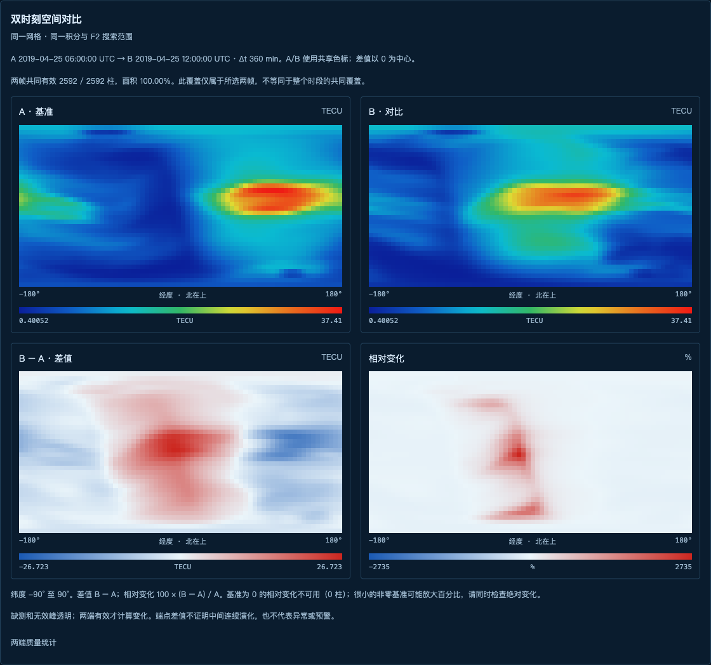
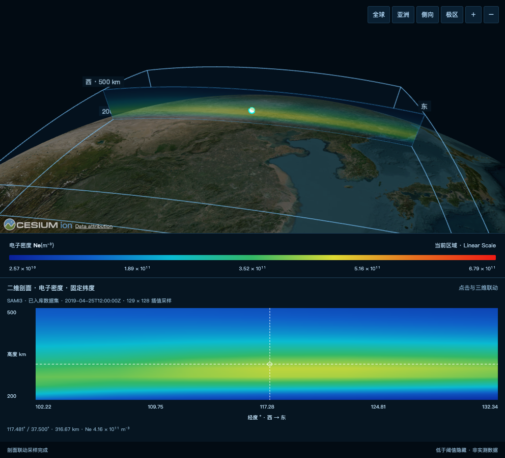
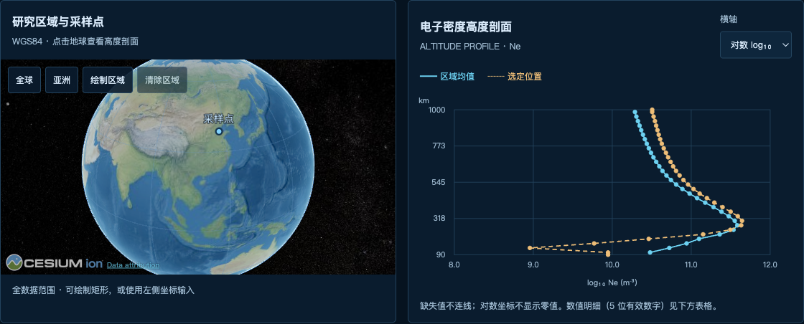
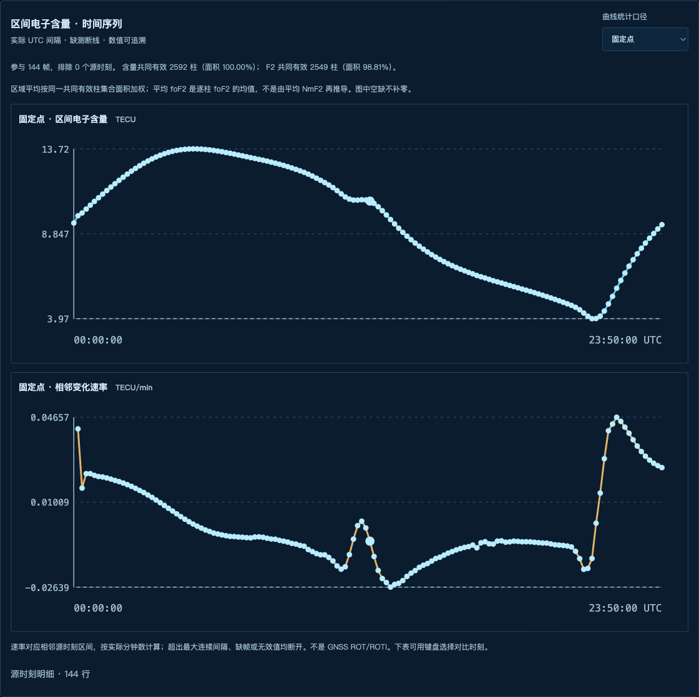
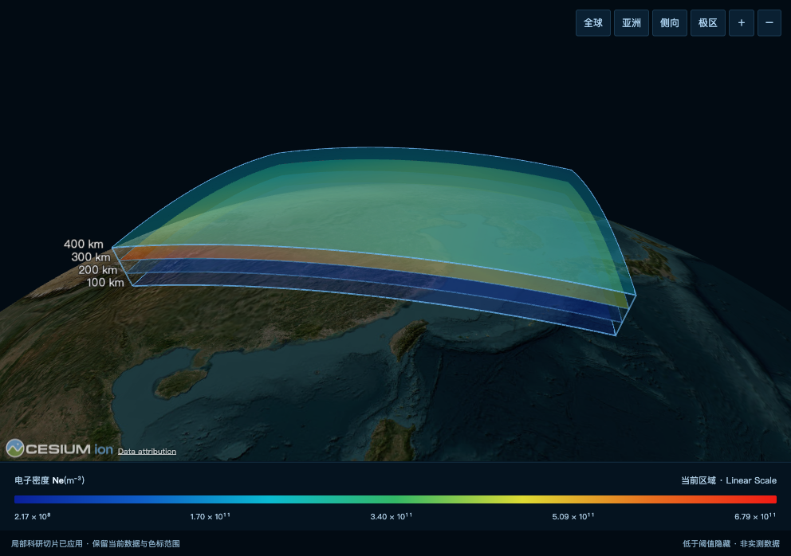
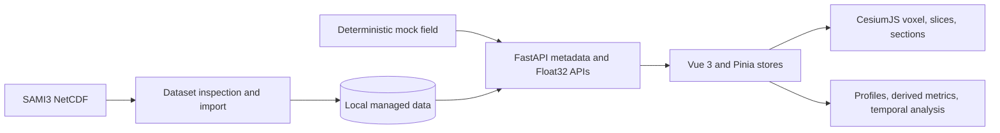

<div align="center">

# CesiumUTC

### Open-source 3D ionosphere analysis and scientific visualization

[](https://github.com/limeng1008/cesiumUTC/actions/workflows/ci.yml)
[](LICENSE)
[](https://www.python.org/)
[](https://vuejs.org/)
[](https://cesium.com/platform/cesiumjs/)

[Quick start](#quick-start) · [Feature gallery](#screenshots) · [Features](#features) · [Architecture](#architecture) · [中文](README.zh-CN.md)


CesiumUTC turns multidimensional ionosphere data into an explorable 3D globe.
It combines native Cesium GPU voxels, geodetic altitude slices, spatial probes,
vertical sections, temporal analysis, and SAMI3 NetCDF ingestion in one
reproducible FastAPI + Vue application.

[Explore the fresh comparison and profile screenshots](#screenshots) · [Watch the original 3D walkthrough](docs/assets/cesiumutc-demo.mp4)

If CesiumUTC is useful to your research or visualization work, **star this repository** to help others discover it.

</div>

## Why CesiumUTC

Ionosphere datasets are four-dimensional, sparse, and difficult to inspect with conventional maps. CesiumUTC keeps the original longitude, latitude, altitude, parameter, and UTC semantics visible while connecting three complementary workflows:

- explore a physical field on a WGS84 globe;
- inspect exact values, regional statistics, profiles, and vertical sections;
- import and manage SAMI3 NetCDF datasets without baking private data into the repository.

Built for ionosphere researchers inspecting SAMI3 output and developers building scientific visualization tools with CesiumJS. The current application interface is primarily Chinese; this README and the setup guide are in English.

The renderer uses local imagery and does not require a Cesium ion token. Deterministic synthetic fields are included for development and algorithm tests. The normal application workflow uses imported datasets: a fresh installation has an empty data catalogue. Imported SAMI3 data remains local and is intentionally excluded from Git.

## Features

| Area | Capabilities |
| --- | --- |
| 3D globe | Native Cesium voxel rendering, WGS84 altitude clipping, value filtering, quality controls, and multiple camera presets |
| Altitude slices | Single or multiple geodetic height surfaces, up to four layers, shared scientific colour mapping, and regional clipping |
| Spatial inspection | Click probe with trilinear or nearest-neighbour sampling, regional selection, longitude/latitude sections, and drawn-path sections |
| Derived analysis | Interval electron content, NmF2, hmF2, foF2, quality masks, provenance, and point profiles derived from electron density |
| Temporal analysis | UTC-aware frame selection, missing-frame preservation, trends, heatmaps, and height-detail tables |
| Data workflow | Dataset upload, inspection, single/batch import, cancellation, progress, parameter selection, and managed-volume catalogues |
| Engineering | Authenticated FastAPI endpoints, binary Float32 transport, Pinia state isolation, deterministic tests, and Docker packaging |

## Screenshots

Fresh captures from the running application, using imported SAMI3 model output for **25 April 2019**. These are real application views, not mockups or observations. The two temporal views below are **development previews**: their implementation is currently local and is not included in the published source. [Capture settings and availability](docs/SHOWCASE.md).

### 1. Compare two UTC timestamps — development preview

See the reference field, comparison field, **B − A**, and relative change together. A and B share one absolute scale; difference maps use zero-centred scales. Shown: interval electron content, **06:00 → 12:00 UTC**, integrated over **90–1000 km**.



### 2. Linked 3D curtains and 2D vertical sections

Inspect a latitude, longitude, or drawn-path section. The 3D curtain and 2D plot share the same sampled grid and colour scale; clicking the plot places the corresponding probe in 3D. Shown: **37.5°N**, **200–500 km**, **12:00 UTC**.



### 3. Point profiles against regional statistics

Select a location on the globe or enter coordinates, then compare its electron-density profile with the regional mean. Shown: **117.5°E, 37.5°N**, **12:00 UTC**; altitude is vertical and electron density uses a logarithmic horizontal axis.



### 4. Full-day evolution and change rates — development preview

Follow **144 ten-minute frames** at a fixed point, with a separate curve for change per minute. The local workspace also supports common-coverage area averages and interval electron content, NmF2, hmF2, and foF2. Missing values stay missing; these rates are **not GNSS ROT/ROTI**.



### 5. Multiple geodetic altitude slices

Explore **100, 200, 300, and 400 km** surfaces together over a selected region, with shared scientific colours and configurable transparency. Heights are geodetic, not visually exaggerated.



<details>
<summary>Original 3D walkthrough · GIF / MP4</summary>

This earlier recording demonstrates the 3D workflow; the screenshots above show the refreshed feature gallery.


[Watch the higher-quality MP4](docs/assets/cesiumutc-demo.mp4)

</details>

## Architecture



- **Backend:** FastAPI, Tortoise ORM, SQLite, NumPy, and netCDF4.
- **Frontend:** Vue 3, Vite, Pinia, Naive UI, TypeScript, and CesiumJS.
- **Rendering:** Cesium `VoxelPrimitive`, ellipsoid-aware height slices, custom shaders, and local Natural Earth II imagery.
- **Data contract:** metadata JSON plus binary Float32 volumes in X-longitude, Y-latitude, Z-altitude order.

More detail is available in [3D volume architecture](docs/IONOSPHERE_VOLUME.md), [vertical sections](docs/IONOSPHERE_SECTIONS.md), [SAMI3 import](docs/SAMI3_IMPORT.md), and [data analysis](docs/DATA_ANALYSIS.md).

## Quick start

### Requirements

- Python 3.11 or newer
- [uv](https://docs.astral.sh/uv/)
- Node.js 20 or newer
- pnpm 10 (Corepack is supported)
- A WebGL2-capable browser and hardware acceleration for the 3D view

### Backend

```bash
git clone https://github.com/limeng1008/cesiumUTC.git
cd cesiumUTC
uv sync --frozen
uv run python run.py
```

The API and OpenAPI UI are available at <http://127.0.0.1:9999/docs>.

### Frontend

In a second terminal:

```bash
# From the cloned cesiumUTC directory
cd web
corepack enable
pnpm install --frozen-lockfile
pnpm dev
```

Open <http://127.0.0.1:3100/ionosphere>.

The upstream scaffold's local development account is `admin` / `123456`. It is provided only for a localhost development database. Change all credentials and security settings before any network-accessible deployment.

See [SETUP.md](SETUP.md) for builds, validation, SAMI3 import, and troubleshooting.

### Your first dataset

1. Sign in and open **Data Management** (数据管理).
2. Upload a compatible SAMI3 NetCDF file, then inspect its parameters and UTC timestamps.
3. Select a parameter and timestamp, start an import, and wait until it is ready.
4. Open that import in the 3D workspace to explore altitude slices and probes; use the analysis and time-variation pages for numerical inspection.

**No dataset yet?** Start with the [recorded walkthrough](docs/assets/cesiumutc-demo.mp4) and [screenshots](#screenshots). A redistributable sample dataset is on the roadmap; research data and runtime databases are not bundled with the repository. See the [SAMI3 format guide](docs/SAMI3_IMPORT.md) before preparing an input file.

## Data formats

CesiumUTC accepts SAMI3-style NetCDF files through the managed-data workflow. An import must resolve:

- longitude, latitude, and altitude axes;
- one or more physical parameters such as electron density (`Ne`) or ion/electron temperature;
- UTC timestamps and parameter units;
- a regular volume that can be normalized to the application's X/Y/Z contract.

The importer rejects ambiguous dimensions, unsupported units, invalid coordinates, and non-finite metadata instead of silently reshaping scientific data. Local imports are written under `data/ionosphere/` and are ignored by Git.

Read [SAMI3 import](docs/SAMI3_IMPORT.md), [batch import](docs/BATCH_IMPORT.md), and [multi-parameter handling](docs/MULTI_PARAMETER.md) before adapting another model.

## Validation

Backend:

```bash
uv run python -m pytest -q
uv run ruff check app scripts tests
uv run python scripts/check_public_repo.py
```

Frontend:

```bash
cd web
pnpm type-check
pnpm test
pnpm build
```

The repository audit rejects tracked databases, NetCDF datasets, environment files, generated dependency trees, build output, and files larger than 10 MiB.

## Scientific scope and limitations

- The bundled mock field is deterministic synthetic data, not an observation or forecast.
- SAMI3 results remain model output and inherit the assumptions and limits of their source configuration.
- `foF2` is derived from model electron density; it is not an ionosonde observation.
- Interval electron content is integrated only over the selected altitude range and is not automatically equivalent to full VTEC or GNSS STEC.
- Screen-space geometry and translucent volume colours are exploratory visualizations. Numerical queries use the application's geodetic grid and interpolation model.

Use domain validation and independent scientific review before using results in research, operations, or decision-making.

## Roadmap

- publish compact, redistributable example datasets;
- add adapters for more ionosphere model and observation formats;
- improve GPU chunk splitting and first-load performance;
- add reproducible benchmark scenes and visual regression checks;
- document production deployment and external authentication patterns.

Roadmap items describe direction, not delivery commitments. Please open a feature request before starting a large change.

## Contributing

Issues, documentation fixes, tests, data adapters, and visualization improvements are welcome. Read [CONTRIBUTING.md](CONTRIBUTING.md) before submitting a pull request. Never attach private datasets, credentials, database snapshots, or access tokens to an issue.

Good starting points include English interface translations, clearer setup instructions, and reproducible browser/GPU compatibility reports. [Report a bug](https://github.com/limeng1008/cesiumUTC/issues/new?template=bug_report.yml) or [suggest a feature](https://github.com/limeng1008/cesiumUTC/issues/new?template=feature_request.yml). If the project helps you, a Star or a link shared with a relevant research group helps it reach more users.

## Security

Report vulnerabilities through the repository's private GitHub security advisory flow. See [SECURITY.md](SECURITY.md). Do not disclose an unpatched vulnerability in a public issue.

## License and acknowledgements

CesiumUTC is available under the [MIT License](LICENSE).

The project is based on [mizhexiaoxiao/vue-fastapi-admin](https://github.com/mizhexiaoxiao/vue-fastapi-admin) and retains the upstream MIT copyright notice. CesiumJS is licensed separately by Cesium GS, Inc.; Cesium runtime attribution is preserved. See [NOTICE](NOTICE) for details.
