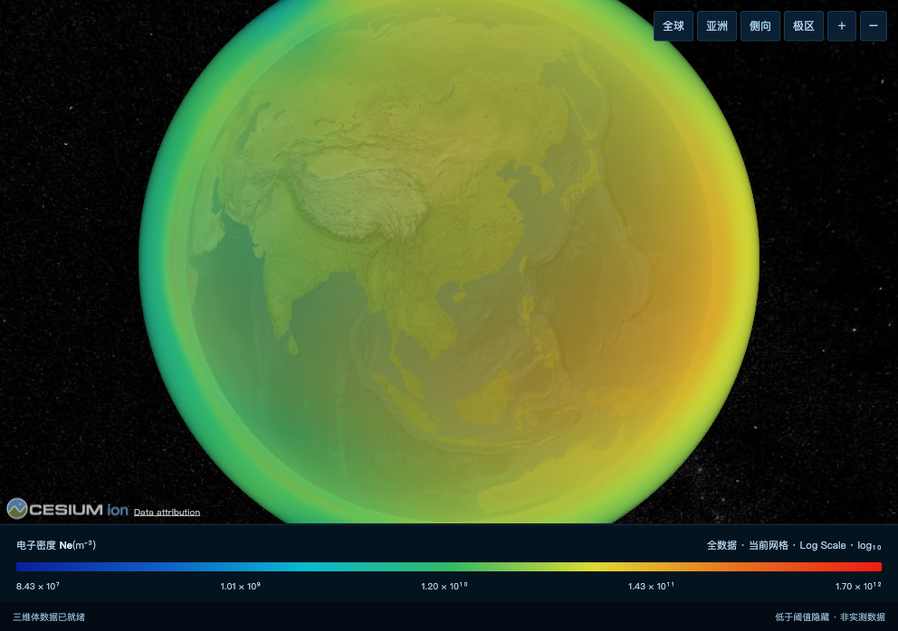
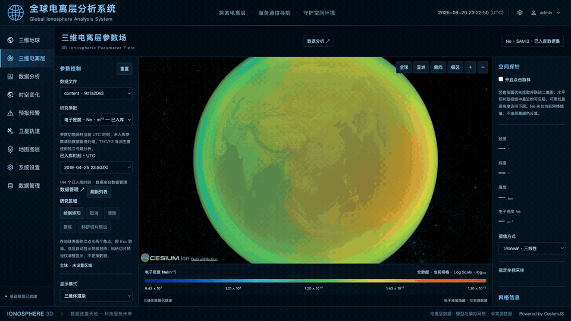
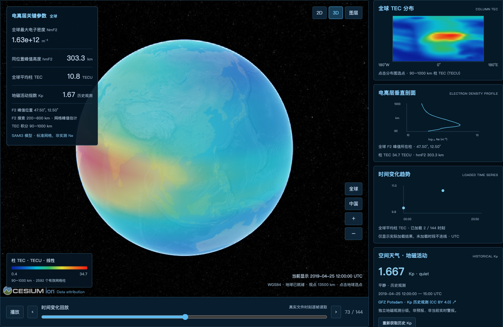
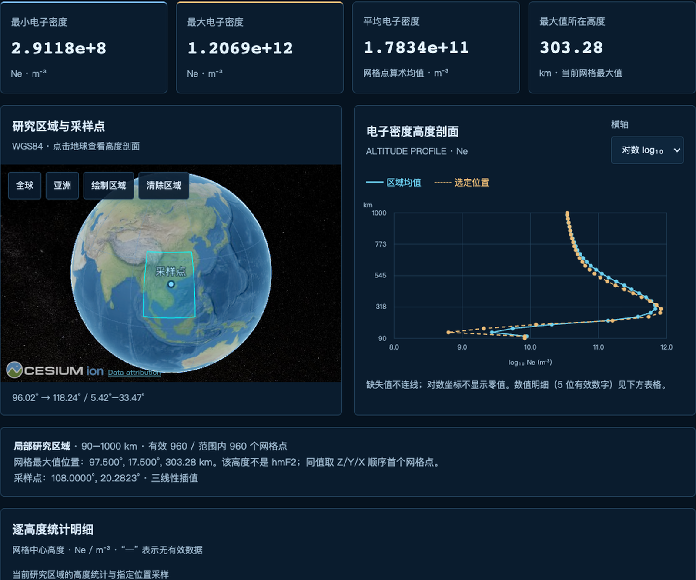
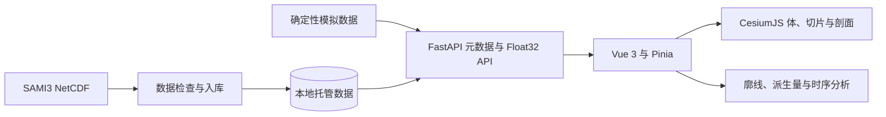

<div align="center">

# CesiumUTC

### 开源三维电离层分析与科学可视化平台

[](https://github.com/limeng1008/cesiumUTC/actions/workflows/ci.yml)
[](LICENSE)
[](https://www.python.org/)
[](https://vuejs.org/)
[](https://cesium.com/platform/cesiumjs/)

[快速开始](#快速开始) · [功能](#功能) · [架构](#架构) · [数据格式](#数据格式) · [English](README.md)



CesiumUTC 将多维电离层数据放到可交互的三维地球中，在一个可复现的 FastAPI + Vue 应用中连接 Cesium GPU Voxel、真实大地高切片、空间探针、垂直剖面、时序分析和 SAMI3 NetCDF 数据导入。



[观看高清 MP4 演示](docs/assets/cesiumutc-demo.mp4)

</div>

## 为什么选择 CesiumUTC

电离层数据包含经度、纬度、高度、物理参数和 UTC 时间等多个维度，普通二维地图难以完整表达。CesiumUTC 将三类工作流连在一起：

- 在 WGS84 三维地球上探索物理场；
- 查询精确数值、区域统计、廓线和垂直剖面；
- 导入和管理 SAMI3 NetCDF 数据，同时避免把私有科研数据提交到 Git。

项目内置确定性模拟数据，无需 Cesium ion token 或科研数据集即可复现界面。导入的 SAMI3 数据仅保存在本地，并明确排除在 Git 之外。

## 功能

| 模块 | 能力 |
| --- | --- |
| 三维地球 | Cesium 原生 Voxel、WGS84 高度裁剪、值域过滤、质量控制和多视角预设 |
| 高度切片 | 单层或最多四层真实大地高曲面、统一科学色标和区域裁剪 |
| 空间分析 | 三线性或最近邻探针、区域框选、经纬向剖面和沿线垂直剖面 |
| 派生分析 | 区间电子含量、NmF2、hmF2、foF2、质量掩膜、来源说明和点位廓线 |
| 时序分析 | UTC 帧选择、缺帧保留、趋势图、热图和逐高度明细表 |
| 数据流程 | 数据集上传、检查、单次/批量入库、取消、进度、参数切换和数据目录 |
| 工程能力 | FastAPI 鉴权接口、Float32 二进制传输、Pinia 状态隔离、确定性测试和 Docker 打包 |

## 截图

### 全球概览



### 科学分析



## 架构



- **后端：** FastAPI、Tortoise ORM、SQLite、NumPy、netCDF4。
- **前端：** Vue 3、Vite、Pinia、Naive UI、TypeScript、CesiumJS。
- **渲染：** Cesium `VoxelPrimitive`、椭球等高切片、自定义着色器和本地 Natural Earth II 底图。
- **数据契约：** JSON 元数据与 X 经度、Y 纬度、Z 高度顺序的 Float32 体数据。

详细说明见[三维体架构](docs/IONOSPHERE_VOLUME.md)、[垂直剖面](docs/IONOSPHERE_SECTIONS.md)、[SAMI3 导入](docs/SAMI3_IMPORT.md)和[数据分析](docs/DATA_ANALYSIS.md)。

## 快速开始

### 环境要求

- Python 3.11+
- [uv](https://docs.astral.sh/uv/)
- Node.js 20+
- pnpm 10（支持 Corepack）
- 支持 WebGL2 且启用硬件加速的浏览器

### 后端

```bash
git clone https://github.com/limeng1008/cesiumUTC.git
cd cesiumUTC
uv sync --frozen
uv run python run.py
```

API 文档：<http://127.0.0.1:9999/docs>。

### 前端

新开一个终端：

```bash
cd web
corepack enable
pnpm install --frozen-lockfile
pnpm dev
```

打开 <http://127.0.0.1:3100/ionosphere>。

上游脚手架提供的本地开发账号为 `admin` / `123456`，仅用于 localhost 开发数据库。任何可被网络访问的部署都必须修改凭证和安全配置。

构建、测试、SAMI3 导入与故障排查请见英文 [SETUP.md](SETUP.md)。

## 数据格式

CesiumUTC 通过托管数据流程接收 SAMI3 风格的 NetCDF 文件。入库必须能够明确解析：

- 经度、纬度和高度轴；
- 电子密度（`Ne`）、电子/离子温度等物理参数；
- UTC 时间戳和参数单位；
- 可规范为应用 X/Y/Z 契约的规则体网格。

导入器会拒绝有歧义的维度、不支持的单位、非法坐标和非有限元数据，不会静默重排科研数据。本地导入写入 `data/ionosphere/`，该目录不进入 Git。

适配其他模型前请阅读 [SAMI3 导入](docs/SAMI3_IMPORT.md)、[批量入库](docs/BATCH_IMPORT.md)和[多参数说明](docs/MULTI_PARAMETER.md)。

## 验证

后端：

```bash
uv run python -m pytest -q
uv run ruff check app scripts tests
uv run python scripts/check_public_repo.py
```

前端：

```bash
cd web
pnpm type-check
pnpm test
pnpm build
```

公开仓库审计会拒绝被 Git 跟踪的数据库、NetCDF、私有环境文件、依赖目录、构建产物和超过 10 MiB 的文件。

## 科学范围与限制

- 内置模拟场为确定性合成数据，不是观测或预报。
- SAMI3 结果仍是模型输出，继承其源配置的假设与限制。
- `foF2` 由模型电子密度推导，不是测高仪观测。
- 区间电子含量仅对所选高度范围积分，不自动等同于完整 VTEC 或 GNSS STEC。
- 屏幕空间几何和半透明颜色用于探索；数值查询使用应用自身的大地坐标网格和插值模型。

在科研、业务或决策场景中使用前，请进行领域验证和独立科学审查。

## 路线图

- 发布紧凑、可再分发的示例数据集；
- 增加更多电离层模型与观测格式适配器；
- 优化 GPU 分块和首次加载性能；
- 增加可复现基准场景和视觉回归检查；
- 完善生产部署和外部鉴权文档。

路线图仅表示方向。开始大型改动前请先提交功能建议。

## 参与贡献

欢迎 Issue、文档修复、测试、数据适配器和可视化改进。提交 PR 前请阅读 [CONTRIBUTING.md](CONTRIBUTING.md)。请勿在 Issue 中附带私有数据、凭证、数据库快照或访问令牌。

## 安全

请通过 GitHub 私有安全公告流程报告漏洞，详见 [SECURITY.md](SECURITY.md)。不要在公开 Issue 中披露尚未修复的漏洞。

## 许可与致谢

CesiumUTC 使用 [MIT License](LICENSE)。

项目基于 [mizhexiaoxiao/vue-fastapi-admin](https://github.com/mizhexiaoxiao/vue-fastapi-admin)，保留上游 MIT 版权声明。CesiumJS 由 Cesium GS, Inc. 另行许可，运行时署名保持可见。详情见 [NOTICE](NOTICE)。
